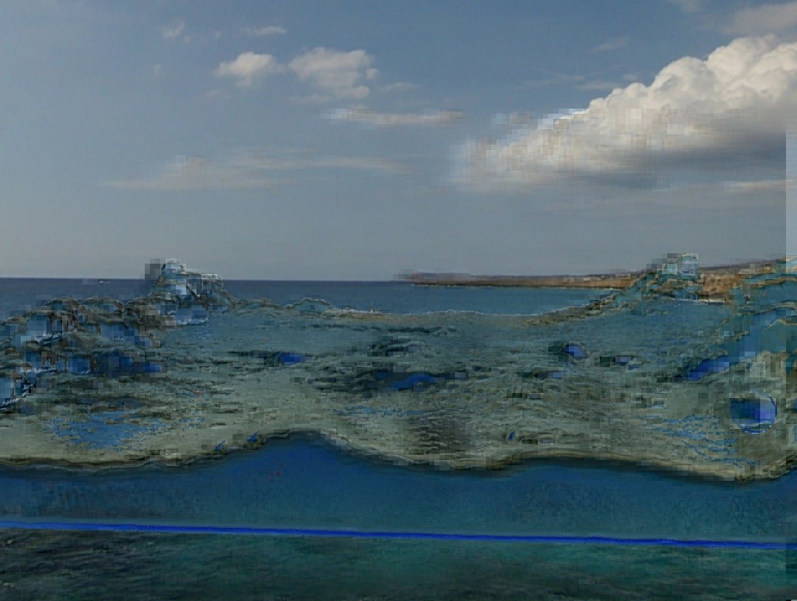
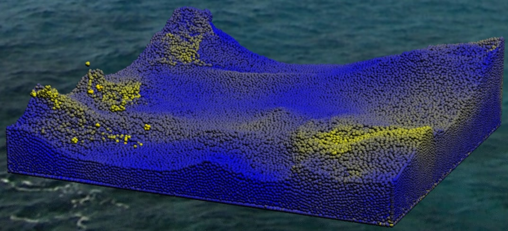
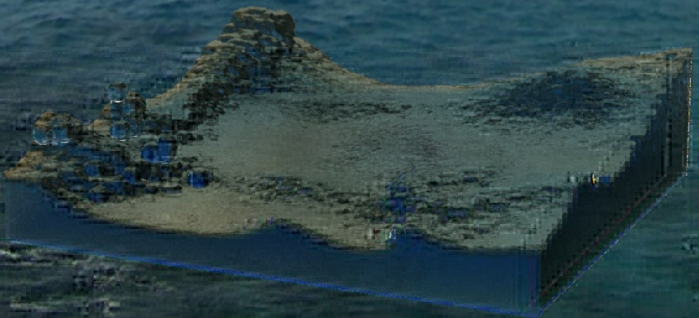

# About

This repository contains the code for a fluid simulation and rendering program made by Julius Thunström and Gustav Nilsson Gisleskog. It was made for the project assignment in the course **High Performance Computer Graphics** at Lund University, and was selected as the best project from the course class of 2024 by a jury of industry professionals.

The project was based on two excellent videos by [Sebastian Lague](https://www.youtube.com/@SebastianLague): [*Coding Adventure: Simulating Fluids*](https://www.youtube.com/watch?v=rSKMYc1CQHE) and [*Coding Adventure: Rendering Fluids*](https://www.youtube.com/watch?v=kOkfC5fLfgE)

    

# Fluid Simulation
A more exact specification of how the system works can be found in [report.pdf](https://github.com/aiviaghost/Fluid-simulation/blob/main/report.pdf), but here below we will simply summarize the work on a high level.

There are some different ways of simulating fluids. This project uses *smoothed-particle hydrodynamics*. In short, it involves modeling the fluid as a big number of particles (in our case on the order of $10^5$). A density field is defined, where the density in a point depends on how many particles are in the proximity. Forces are then applied to the particles to move them from areas of high density to areas of lower density.
In order to compute the forces quickly, we use compute shaders along with a technique called spatial hashing.

    
    
    Rendered particles compared with ray marching

One option is to simply display the fluid as a collection of particles, and with the high number of particles being simulated, this does look fine. However, we also implemented ray marching to render a realistic fluid based on the simulated particles. Each pixel fires a ray that steps through the fluid and picks up color. Reflection and refraction upon entering the fluid are also approximated.

In order to get a nice background instead of pure darkness, a skybox is set to surround the area. When rays from the ray marching leave the fluid, they are sent into the skybox to finalize the color of the assiciated pixel.
